# 📊 DIAGRAMES DE FLUX - FORMAT MERMAID

Aquest document conté diagrames de flux en format Mermaid que poden ser visualitzats a GitHub, en editors compatibles o utilitzant https://mermaid.live/

---

## 🔄 Diagrama 1: Flux Principal Complet

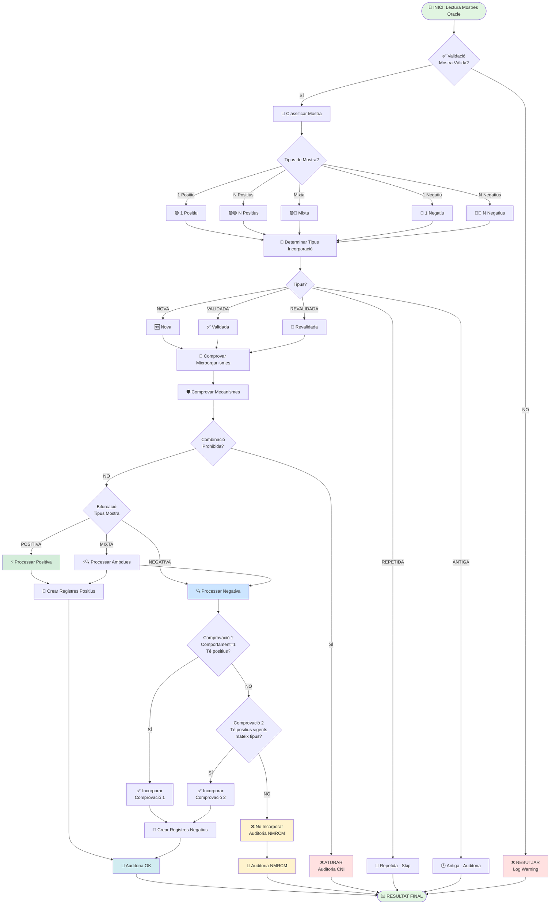

---

## 🧪 Diagrama 2: Classificació de Mostra

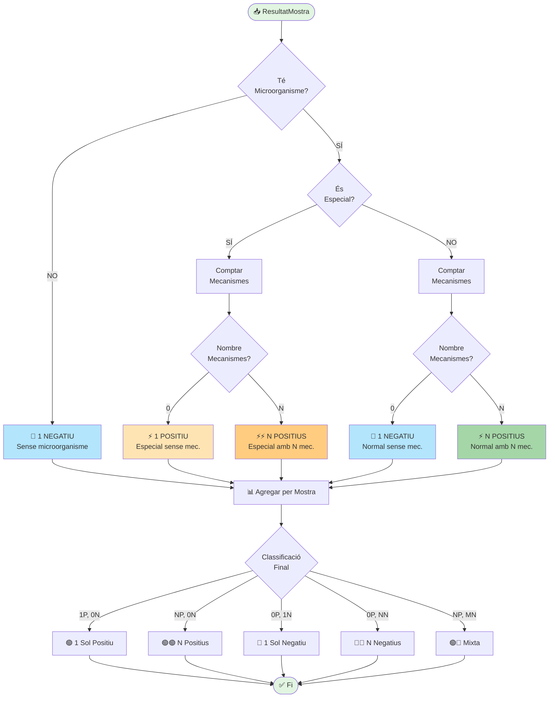

---

## 🦠 Diagrama 3: Comprovació Microorganismes

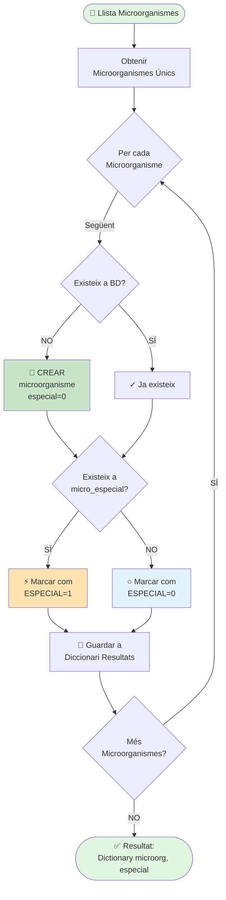

---

## 🛡️ Diagrama 4: Comprovació Mecanismes

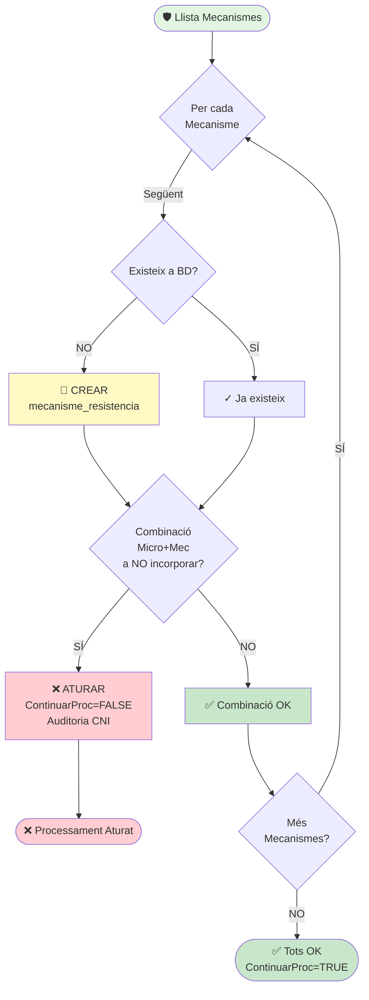

---

## ⚡ Diagrama 5: Processar Mostra Positiva

```mermaid
flowchart TD
    Start([⚡ Mostra Positiva]) --> GetPatient[🌐 Obtenir Pacient<br/>WebService]
    
    GetPatient --> PatientFound{Pacient<br/>Trobat?}
    
    PatientFound -->|NO| Warning[⚠️ Warning<br/>Pacient no trobat<br/>Continuar igualment]
    PatientFound -->|SÍ| CheckPD
    
    Warning --> CheckPD{Pacient existeix a<br/>pacients_diagnostics?}
    
    CheckPD -->|NO| CreatePD[💾 INSERT<br/>pacients_diagnostics]
    CheckPD -->|SÍ| ExistsPD[✓ Ja existeix]
    
    CreatePD --> LoopResults
    ExistsPD --> LoopResults[📋 Per cada resultat POSITIU]
    
    LoopResults --> CreatePDM[💾 CREATE/UPDATE<br/>pacients_diagnostics_mostra<br/>valoracio='2']
    
    CreatePDM --> CreateMM[💾 CREATE<br/>mostra_microorganisme]
    
    CreateMM --> HasMech{Té<br/>Mecanismes?}
    
    HasMech -->|SÍ| CreateMech[💾 CREATE<br/>micro_mecanisme_mostra<br/>per cada mecanisme 1-5]
    HasMech -->|NO| CheckTypes
    
    CreateMech --> CheckTypes{Tipus Mostra/Prova<br/>existeixen?}
    
    CheckTypes -->|NO| CreateTypes[💾 CREATE<br/>tipusmostra_m<br/>tipusprova_m]
    CheckTypes -->|SÍ| UpdateDates
    
    CreateTypes --> UpdateDates[📅 Actualitzar Dates Pacient<br/>última inclusió<br/>última mostra positiva]
    
    UpdateDates --> MoreResults{Més resultats<br/>positius?}
    
    MoreResults -->|SÍ| LoopResults
    MoreResults -->|NO| Audit[📝 Auditoria<br/>Codi: OK]
    
    Audit --> Result([✅ Resultat OK])
    
    style Start fill:#e1f5e1
    style Result fill:#c8e6c9
    style Warning fill:#fff3cd
    style Audit fill:#d1ecf1
```

---

## 🔍 Diagrama 6: Processar Mostra Negativa (Comprovacions)

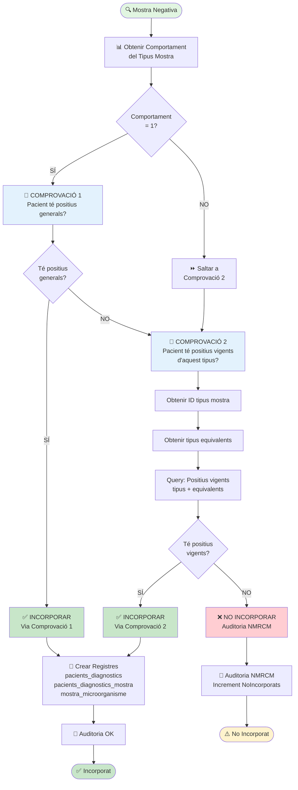

---

## 🎯 Diagrama 7: Determinar Tipus Incorporació

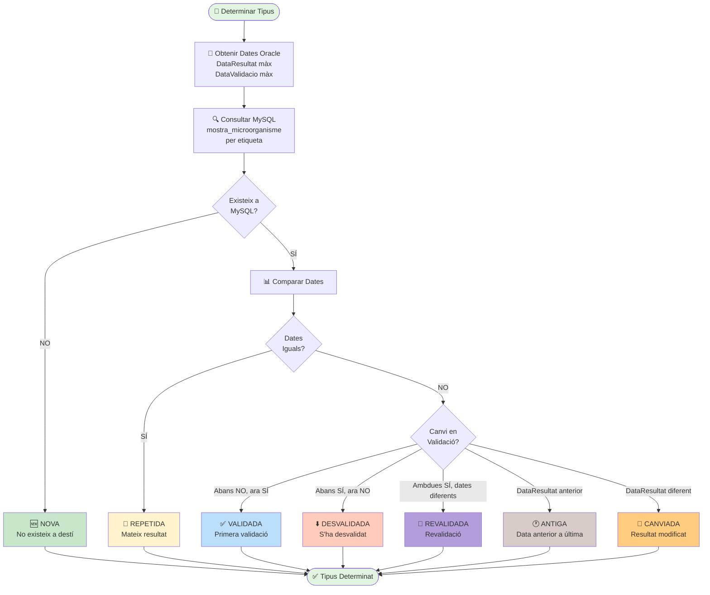

---

## 📊 Diagrama 8: Flux de Dades entre Sistemes

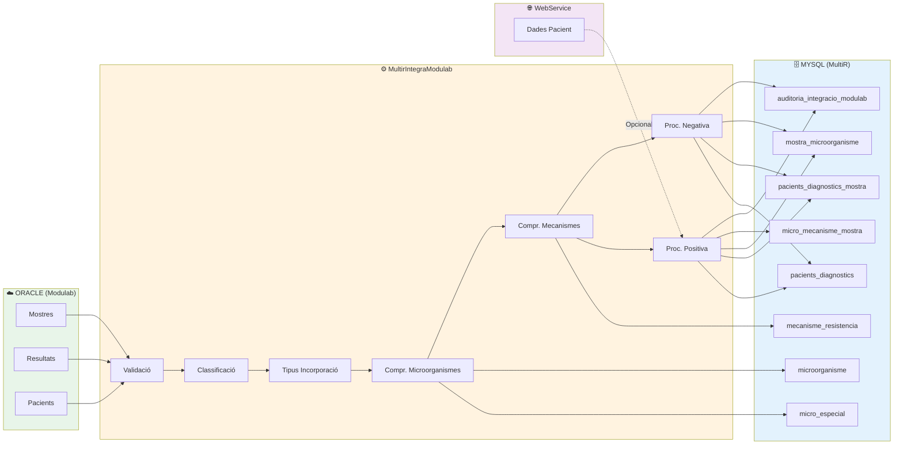

---

## 🔄 Diagrama 9: Cicle de Vida d'una Mostra

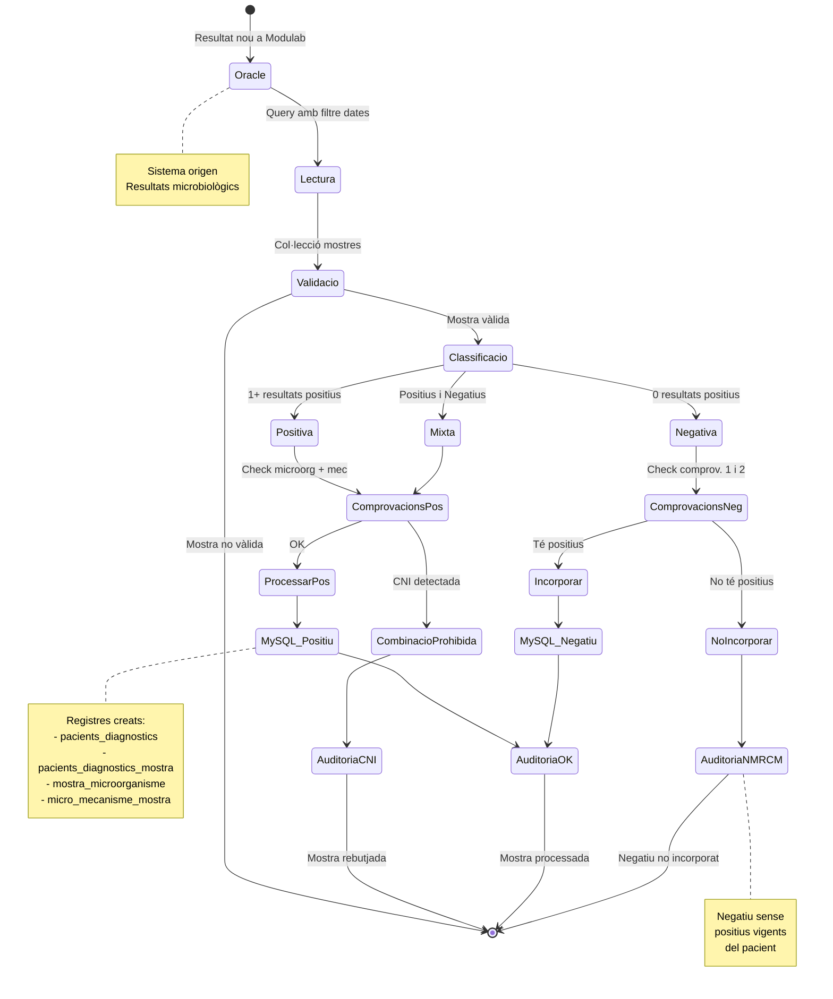

---

## 📈 Diagrama 10: Model de Dades Simplificat

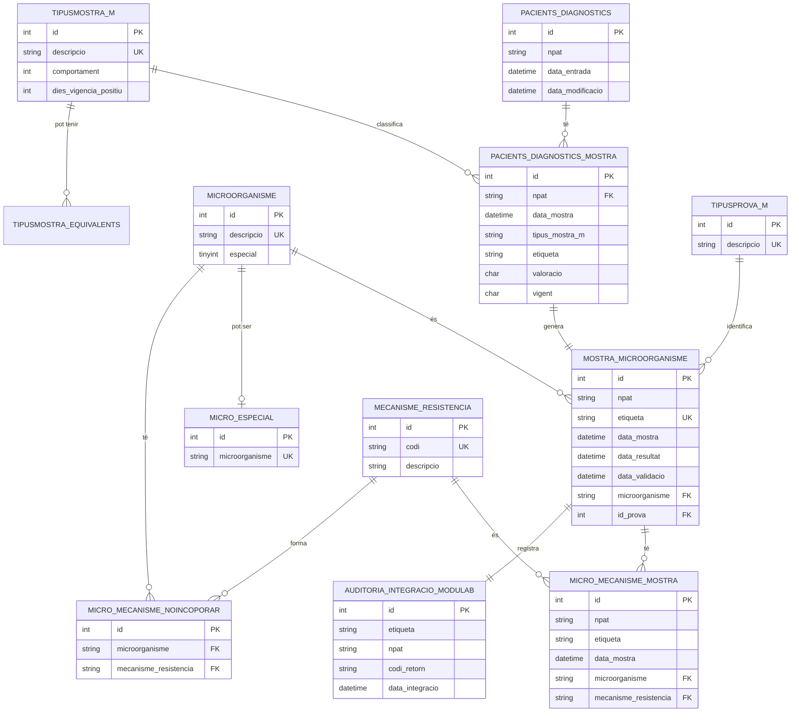

---

## 🎯 Llegenda de Colors i Símbols

### Colors dels Nodes

- 🟢 **Verd clar** (#e1f5e1): Inici/Fi de flux
- 🟢 **Verd** (#c8e6c9): Acció exitosa, incorporació
- 🔵 **Blau** (#e3f2fd): Comprovacions, queries
- 🟡 **Groc** (#fff3cd): Warnings, situacions especials
- 🟠 **Taronja** (#ffe4b3): Microorganismes especials
- 🔴 **Vermell clar** (#ffcdd2): Errors, rebutjos
- ⚪ **Gris** (#f5f5f5): Processos neutrals

### Símbols Utilitzats

- 🏁 Inici de procés
- ✅ Validació/Comprovació OK
- ❌ Error/Rebuig
- 🔎 Cerca/Query
- 💾 Crear/Actualitzar BD
- 📝 Auditoria
- 🧪 Classificació
- 🦠 Microorganismes
- 🛡️ Mecanismes
- ⚡ Positiu
- 🔵 Negatiu
- 🌐 WebService
- 📊 Resultat/Estadística
- 🔄 Actualització/Revalidació
- ⚠️ Warning

---

## 📝 Notes d'Ús

### Visualitzar Diagrames

1. **GitHub**: Els diagrames Mermaid es renderitzen automàticament
2. **VS Code**: Instal·lar extensió "Markdown Preview Mermaid Support"
3. **Online**: Copiar codi a https://mermaid.live/
4. **Exportar**: Des de mermaid.live es pot exportar a PNG, SVG, PDF

### Modificar Diagrames

Els diagrames són text pla i es poden editar fàcilment:

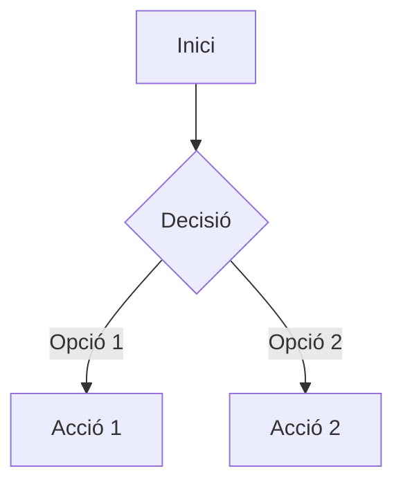

### Sintaxi Bàsica

- `flowchart TD`: Diagrama de flux de dalt a baix (Top-Down)
- `flowchart LR`: Diagrama de flux d'esquerra a dreta (Left-Right)
- `-->`: Fletxa simple
- `-.->`: Fletxa puntejada
- `==>`: Fletxa gruixuda
- `[ ]`: Node rectangular
- `{ }`: Node de decisió (rombe)
- `(( ))`: Node circular
- `[( )]`: Node cilíndric (BD)

---

**Documentació creada**: Gener 2025  
**Versió**: 1.0  
**Format**: Mermaid.js  
**Compatibilitat**: GitHub, GitLab, VS Code, Mermaid Live Editor
