# 📊 DIAGRAMES DE FLUX - FORMAT MERMAID

Aquest document conté diagrames de flux en format Mermaid que poden ser visualitzats a GitHub, en editors compatibles o utilitzant https://mermaid.live/

---

## 🔄 Diagrama 1: Flux Principal Complet (ACTUALITZAT amb VR)

```mermaid
flowchart TD
    Start([� INICI: Lectura Mostres Oracle]) --> Validate{✅ Validació<br/>Mostra Vàlida?}
    
    Validate -->|NO| Reject[� REBUTJAR<br/>Log Warning]
    Validate -->|S�| DeterminarTipus[� Determinar Tipus Incorporació]
    
    DeterminarTipus --> TypeResult{Tipus?}
    TypeResult -->|NOVA| Nova[🆕 Nova]
    TypeResult -->|REPETIDA| Repetida[� Repetida - Skip]
    TypeResult -->|VALIDADA| Validada[✅ Validada]
    TypeResult -->|REVALIDADA| Revalidada[🔄 Revalidada]
    TypeResult -->|ANTIGA| Antiga[� Antiga - Auditoria]
    
    Repetida & Antiga --> Result
    Nova & Validada & Revalidada --> CheckMicro[🦠 Comprovar Microorganismes]
    
    CheckMicro --> CheckMech[🛡� Comprovar Mecanismes]
    
    CheckMech --> MechResult{Tots resultats<br/>tenen CNI?}
    
    MechResult -->|S�| BlockCNI[� ATURAR<br/>Auditoria CNI<br/>Mostra descartada]
    MechResult -->|NO| TipusMicro{Tipus<br/>Microorganisme?}
    
    TipusMicro -->|MMR| ClassifyMMR[🧪 Classificar Mostra MMR]
    TipusMicro -->|VR| ProcessVR[🦠 Processar Virus Respiratori]
    TipusMicro -->|MIXT| ProcessMixt[🔀 Processar Mixta MMR+VR]
    
    ClassifyMMR --> ClassifyResult{Tipus Mostra MMR?}
    
    ClassifyResult -->|1 Positiu| Positive1[🟢 1 Positiu]
    ClassifyResult -->|N Positius| PositiveN[🟢🟢 N Positius]
    ClassifyResult -->|1 Negatiu| Negative1[🔵 1 Negatiu]
    ClassifyResult -->|N Negatius| NegativeN[🔵🔵 N Negatius]
    ClassifyResult -->|Mixta| Mixed[🟢🔵 Mixta]
    
    Positive1 & PositiveN --> ProcessPos[âš¡ Processar Positiva MMR]
    Negative1 & NegativeN --> ProcessNeg[� Processar Negativa MMR]
    Mixed --> ProcessBoth[⚡� Processar Mixta MMR]
    
    ProcessPos --> CreatePos[💾 Crear Registres Positius MMR]
    ProcessNeg --> CheckNeg1{Comprovació 1<br/>Comportament=1<br/>Té positius?}
    
    CheckNeg1 -->|S�| IncorporateC1[✅ Incorporar<br/>Comprovació 1]
    CheckNeg1 -->|NO| CheckNeg2{Comprovació 2<br/>Té positius vigents<br/>mateix tipus?}
    
    CheckNeg2 -->|S�| IncorporateC2[✅ Incorporar<br/>Comprovació 2]
    CheckNeg2 -->|NO| NoIncorporate[� No Incorporar<br/>Auditoria NMRCM]
    
    CreatePos --> AuditMMR[� Auditoria OK MMR]
    IncorporateC1 & IncorporateC2 --> CreateNeg[💾 Crear Registres Negatius]
    CreateNeg --> AuditMMR
    NoIncorporate --> AuditNMRCM[� Auditoria NMRCM]
    
    ProcessBoth --> CreatePos & ProcessNeg
    
    ProcessVR --> CheckProva{Tipus Prova<br/>permet VR?}
    CheckProva -->|NO| AuditTPNIVR[� Auditoria TPNIVR]
    CheckProva -->|S�| CheckCentre{Centre<br/>permet VR?}
    CheckCentre -->|NO| AuditCNIVR[� Auditoria CNIVR]
    CheckCentre -->|S�| CreateVR[💾 Crear Registres VR<br/>SEMPRE positius]
    
    CreateVR --> NotaVR[� Nota Curs Clínic VR]
    NotaVR --> AuditVR[� Auditoria OK VR]
    
    ProcessMixt --> ProcessMMRMixt[âš¡ Processar part MMR]
    ProcessMixt --> ProcessVRMixt[🦠 Processar part VR]
    ProcessMMRMixt & ProcessVRMixt --> AuditMixt[� Auditoria Mixta]
    
    AuditMMR & AuditNMRCM & AuditVR & AuditMixt & AuditTPNIVR & AuditCNIVR & BlockCNI --> Result([📊 RESULTAT FINAL])
    Reject --> Result
    
    style Start fill:#e1f5e1
    style Result fill:#e1f5e1
    style Reject fill:#ffe1e1
    style BlockCNI fill:#ffe1e1
    style NoIncorporate fill:#fff3cd
    style ProcessVR fill:#e1d5f0
    style CreateVR fill:#d5e8f0
    style NotaVR fill:#d5e8f0
    style ProcessMixt fill:#ffe4b3
    style AuditMMR fill:#d1ecf1
    style AuditVR fill:#e8d5f0
    style AuditNMRCM fill:#fff3cd
    style ProcessPos fill:#d4edda
    style ProcessNeg fill:#cce5ff
```

---

## 🧪 Diagrama 2: Classificació de Mostra MMR


---

## 🦠 Diagrama 3: Flux Específic Virus Respiratoris (NOU)

```mermaid
flowchart TD
    Start([🦠 Mostra amb VR]) --> CheckProva{Tipus Prova<br/>existeix i permet VR?}
    
    CheckProva -->|NO| RejectProva[� REBUTJAR<br/>Auditoria TPNIVR]
    CheckProva -->|S�| CheckCentre{Centre a llista<br/>VR_CENTRES?}
    
    CheckCentre -->|NO| RejectCentre[� REBUTJAR<br/>Auditoria CNIVR]
    CheckCentre -->|S�| CheckPacient{Pacient<br/>existeix?}
    
    CheckPacient -->|S�| PacientOK[✓ Pacient existent]
    CheckPacient -->|NO| WebService[� Consultar WebService]
    
    WebService --> WSResult{Trobat?}
    WSResult -->|NO| RejectWS[� REBUTJAR<br/>Auditoria NPWS]
    WSResult -->|S�| CreatePacient[💾 Crear Pacient]
    
    CreatePacient --> LoopVR
    PacientOK --> LoopVR[📋 Per cada Virus Respiratori]
    
    LoopVR --> CheckMicroVR{Microorganisme VR<br/>existeix?}
    CheckMicroVR -->|NO| CreateMicroVR[💾 Crear Microorganisme VR]
    CheckMicroVR -->|S�| ExistsMicroVR[✓ Ja existeix]
    
    CreateMicroVR --> CreateDiagVR
    ExistsMicroVR --> CreateDiagVR[💾 Crear/Obtenir<br/>Diagnòstic VR<br/>mecanisme=NULL]
    
    CreateDiagVR --> CreateMostraVR[💾 Crear/Obtenir<br/>Mostra Diagnòstic VR<br/>valoracio='2']
    
    CreateMostraVR --> CreateRelacioVR[💾 Crear Relació<br/>mostra_microorganisme VR]
    
    CreateRelacioVR --> UpdateDatesVR[📅 Actualitzar dates]
    
    UpdateDatesVR --> MoreVR{Més VR<br/>a processar?}
    MoreVR -->|S�| LoopVR
    MoreVR -->|NO| NotaClinica{Cal nota<br/>curs clínic?}
    
    NotaClinica -->|S�| CreateNota[� Crear Nota VR<br/>curs clínic]
    NotaClinica -->|NO| SkipNota[� Saltar nota]
    
    CreateNota --> AuditOK
    SkipNota --> AuditOK[� Auditoria OK]
    
    AuditOK --> Success([✅ VR Processats])
    RejectProva & RejectCentre & RejectWS --> Fail([� VR Rebutjats])
    
    style Start fill:#e1f5e1
    style Success fill:#d5e8f0
    style Fail fill:#ffcdd2
    style CreateMicroVR fill:#c8e6c9
    style CreateNota fill:#bbdefb
    style RejectProva fill:#ffcdd2
    style RejectCentre fill:#ffcdd2
    style RejectWS fill:#ffcdd2
```

---

## 🔀 Diagrama 4: Flux Mostra Mixta MMR + VR (NOU)

```mermaid
flowchart TD
    Start([🔀 Mostra Mixta<br/>MMR + VR]) --> SeparateTypes[🔀 Separar per Tipus]
    
    SeparateTypes --> MMRResults[📊 Resultats MMR]
    SeparateTypes --> VRResults[🦠 Resultats VR]
    
    MMRResults --> ClassifyMMR[🧪 Classificar MMR]
    VRResults --> ProcessVR[🦠 Processar VR]
    
    ClassifyMMR --> TypeMMR{Tipus<br/>Mostra MMR?}
    
    TypeMMR -->|Positiva| ProcessPosMMR[âš¡ Processar Positiva MMR]
    TypeMMR -->|Negativa| ProcessNegMMR[� Processar Negativa MMR]
    TypeMMR -->|Mixta| ProcessMixtaMMR[⚡� Processar Mixta MMR]
    
    ProcessPosMMR --> ResultMMR[✅ MMR Processat]
    ProcessNegMMR --> ResultMMR
    ProcessMixtaMMR --> ResultMMR
    
    ProcessVR --> CheckProvaVR{Tipus Prova<br/>permet VR?}
    CheckProvaVR -->|NO| RejectVR[� VR Rebutjat]
    CheckProvaVR -->|S�| CheckCentreVR{Centre<br/>permet VR?}
    
    CheckCentreVR -->|NO| RejectVR
    CheckCentreVR -->|S�| CreateVR[💾 Crear Registres VR]
    
    CreateVR --> ResultVR[✅ VR Processat]
    
    ResultMMR --> Combine[🔗 Combinar Resultats]
    ResultVR --> Combine
    RejectVR --> Combine
    
    Combine --> UpdateDates[📅 Actualitzar Dates Globals]
    UpdateDates --> AuditMixt[� Auditoria Mixta]
    
    AuditMixt --> Result([✅ Mostra Mixta Processada])
    
    style Start fill:#ffe4b3
    style Result fill:#c8e6c9
    style ProcessPosMMR fill:#d4edda
    style ProcessNegMMR fill:#cce5ff
    style ProcessVR fill:#e1d5f0
    style CreateVR fill:#d5e8f0
    style RejectVR fill:#ffcdd2
    style Combine fill:#fff9c4
```

---

## 🦠 Diagrama 5: Comprovar Microorganismes

```mermaid
flowchart TD
    Start([🦠 Llista Microorganismes]) --> GetUnique[Obtenir<br/>Microorganismes Únics]
    
    GetUnique --> Loop{Per cada<br/>Microorganisme}
    
    Loop -->|Següent| CheckExists{Existeix a BD?}
    
    CheckExists -->|NO| Create[💾 CREAR<br/>microorganisme<br/>especial=0]
    CheckExists -->|S�| Exists[✓ Ja existeix]
    
    Create --> CheckSpecialTable
    Exists --> CheckSpecialTable{Existeix a<br/>micro_especial?}
    
    CheckSpecialTable -->|S�| MarkSpecial[⚡ Marcar com<br/>ESPECIAL=1]
    CheckSpecialTable -->|NO| MarkNormal[â—‹ Marcar com<br/>ESPECIAL=0]
    
    MarkSpecial & MarkNormal --> Store[� Guardar a<br/>Diccionari Resultats]
    
    Store --> More{Més<br/>Microorganismes?}
    
    More -->|S�| Loop
    More -->|NO| Result([✅ Resultat:<br/>Dictionary microorg, especial])
    
    style Start fill:#e1f5e1
    style Result fill:#e1f5e1
    style Create fill:#c8e6c9
    style MarkSpecial fill:#ffe4b3
    style MarkNormal fill:#e3f2fd
```

---

## 🛡� Diagrama 6: Comprovació Mecanismes (ACTUALITZAT)

```mermaid
flowchart TD
    Start([🛡� Per cada Resultat]) --> HasMech{Té<br/>Mecanismes?}
    
    HasMech -->|NO| SkipMech[� Sense mecanismes<br/>OK per VR]
    HasMech -->|S�| LoopMech[Per cada<br/>Mecanisme]
    
    LoopMech --> CheckExists{Mecanisme<br/>existeix a BD?}
    
    CheckExists -->|NO| Create[💾 CREAR<br/>mecanisme_resistencia]
    CheckExists -->|S�| Exists[✓ Ja existeix]
    
    Create --> CheckCombo
    Exists --> CheckCombo{Combinació<br/>Micro+Mec<br/>a NO incorporar?}
    
    CheckCombo -->|S�| RemoveResult[� ELIMINAR resultat<br/>de la llista<br/>Auditoria CNI]
    CheckCombo -->|NO| OK[✅ Combinació OK]
    
    RemoveResult --> MoreMech{Més<br/>Mecanismes?}
    OK --> MoreMech
    
    MoreMech -->|S�| LoopMech
    MoreMech -->|NO| CheckEmpty{Queden<br/>resultats?}
    
    SkipMech --> Success
    CheckEmpty -->|S�| Success([✅ Continuar<br/>Processament])
    CheckEmpty -->|NO| Fail([� Tots eliminats<br/>Mostra descartada])
    
    style Start fill:#e1f5e1
    style Success fill:#c8e6c9
    style Fail fill:#ffcdd2
    style RemoveResult fill:#ffcdd2
    style Create fill:#fff9c4
    style OK fill:#c8e6c9
```

---

## âš¡ Diagrama 7: Processar Mostra Positiva MMR

```mermaid
flowchart TD
    Start([⚡ Mostra Positiva MMR]) --> GetPatient[� Obtenir Pacient<br/>WebService]
    
    GetPatient --> PatientFound{Pacient<br/>Trobat?}
    
    PatientFound -->|NO| Warning[⚠� Warning<br/>Pacient no trobat<br/>Continuar igualment]
    PatientFound -->|S�| CheckPD
    
    Warning --> CheckPD{Pacient existeix a<br/>pacients_diagnostics?}
    
    CheckPD -->|NO| CreatePD[💾 INSERT<br/>pacients_diagnostics]
    CheckPD -->|S�| ExistsPD[✓ Ja existeix]
    
    CreatePD --> LoopResults
    ExistsPD --> LoopResults[📋 Per cada resultat POSITIU MMR]
    
    LoopResults --> CreatePDM[💾 CREATE/UPDATE<br/>pacients_diagnostics_mostra<br/>valoracio='2']
    
    CreatePDM --> CreateMM[💾 CREATE<br/>mostra_microorganisme]
    
    CreateMM --> HasMech{Té<br/>Mecanismes?}
    
    HasMech -->|S�| CreateMech[💾 CREATE<br/>micro_mecanisme_mostra<br/>per cada mecanisme 1-5]
    HasMech -->|NO| CheckTypes
    
    CreateMech --> CheckTypes{Tipus Mostra/Prova<br/>existeixen?}
    
    CheckTypes -->|NO| CreateTypes[💾 CREATE<br/>tipusmostra_m<br/>tipusprova_m]
    CheckTypes -->|S�| UpdateDates
    
    CreateTypes --> UpdateDates[📅 Actualitzar Dates Pacient<br/>última inclusió<br/>última mostra positiva]
    
    UpdateDates --> MoreResults{Més resultats<br/>positius?}
    
    MoreResults -->|S�| LoopResults
    MoreResults -->|NO| Audit[� Auditoria<br/>Codi: OK]
    
    Audit --> Result([✅ Resultat OK])
    
    style Start fill:#e1f5e1
    style Result fill:#c8e6c9
    style Warning fill:#fff3cd
    style Audit fill:#d1ecf1
```

---

## � Diagrama 8: Processar Mostra Negativa (Comprovacions)

```mermaid
flowchart TD
    Start([� Mostra Negativa]) --> GetComportament[📊 Obtenir Comportament<br/>del Tipus Mostra]
    
    GetComportament --> CheckComportament{Comportament<br/>= 1?}
    
    CheckComportament -->|S�| Comp1[� COMPROVACIÓ 1<br/>Pacient té positius generals?]
    CheckComportament -->|NO| Comp2Direct[� Saltar a<br/>Comprovació 2]
    
    Comp1 --> HasGeneral{Té positius<br/>generals?}
    
    HasGeneral -->|S�| IncorpC1[✅ INCORPORAR<br/>Via Comprovació 1]
    HasGeneral -->|NO| Comp2[� COMPROVACIÓ 2<br/>Pacient té positius vigents<br/>d'aquest tipus?]
    
    Comp2Direct --> Comp2
    
    Comp2 --> GetTipusId[Obtenir ID tipus mostra]
    GetTipusId --> GetEquiv[Obtenir tipus equivalents]
    GetEquiv --> QueryVigents[Query: Positius vigents<br/>tipus + equivalents]
    
    QueryVigents --> HasVigent{Té positius<br/>vigents?}
    
    HasVigent -->|S�| IncorpC2[✅ INCORPORAR<br/>Via Comprovació 2]
    HasVigent -->|NO| NoIncorp[� NO INCORPORAR<br/>Auditoria NMRCM]
    
    IncorpC1 --> CreateRecords[💾 Crear Registres<br/>pacients_diagnostics<br/>pacients_diagnostics_mostra<br/>mostra_microorganisme]
    IncorpC2 --> CreateRecords
    
    CreateRecords --> AuditOK[� Auditoria OK]
    NoIncorp --> AuditNMRCM[� Auditoria NMRCM<br/>Increment NoIncorporats]
    
    AuditOK --> ResultOK([✅ Incorporat])
    AuditNMRCM --> ResultNo([⚠� No Incorporat])
    
    style Start fill:#e1f5e1
    style ResultOK fill:#c8e6c9
    style ResultNo fill:#fff3cd
    style IncorpC1 fill:#c8e6c9
    style IncorpC2 fill:#c8e6c9
    style NoIncorp fill:#ffcdd2
    style Comp1 fill:#e3f2fd
    style Comp2 fill:#e3f2fd
```

---

## � Diagrama 9: Determinar Tipus Incorporació

```mermaid
flowchart TD
    Start([� Determinar Tipus]) --> GetDatesOracle[📅 Obtenir Dates Oracle<br/>DataResultat màx<br/>DataValidacio màx]
    
    GetDatesOracle --> QueryMySQL[� Consultar MySQL<br/>mostra_microorganisme<br/>per etiqueta]
    
    QueryMySQL --> ExistsMySQL{Existeix a<br/>MySQL?}
    
    ExistsMySQL -->|NO| Nova[🆕 NOVA<br/>No existeix a destí]
    ExistsMySQL -->|S�| CompareDates[📊 Comparar Dates]
    
    CompareDates --> SameDates{Dates<br/>Iguals?}
    
    SameDates -->|S�| Repetida[� REPETIDA<br/>Mateix resultat]
    SameDates -->|NO| CheckValidation{Canvi en<br/>Validació?}
    
    CheckValidation -->|Abans NO, ara S�| Validada[✅ VALIDADA<br/>Primera validació]
    CheckValidation -->|Abans S�, ara NO| Desvalidada[⬇� DESVALIDADA<br/>S'ha desvalidat]
    CheckValidation -->|Ambdues S�, dates diferents| Revalidada[🔄 REVALIDADA<br/>Revalidació]
    CheckValidation -->|DataResultat anterior| Antiga[� ANTIGA<br/>Data anterior a última]
    CheckValidation -->|DataResultat diferent| Canviada[🔄 CANVIADA<br/>Resultat modificat]
    
    Nova & Repetida & Validada & Desvalidada & Revalidada & Antiga & Canviada --> Result([✅ Tipus Determinat])
    
    style Start fill:#e1f5e1
    style Result fill:#e1f5e1
    style Nova fill:#c8e6c9
    style Repetida fill:#fff3cd
    style Validada fill:#bbdefb
    style Revalidada fill:#b39ddb
    style Desvalidada fill:#ffccbc
    style Antiga fill:#d7ccc8
    style Canviada fill:#ffcc80
```
    
    style Start fill:#e1f5e1
    style End fill:#e1f5e1
    style Nova fill:#c8e6c9
    style Repetida fill:#fff3cd
    style Validada fill:#c8e6c9
    style Desvalidada fill:#ffcdd2
    style Antiga fill:#e3f2fd
```

---
## ?? Diagrama 10: Flux de Dades entre Sistemes (ACTUALITZAT)

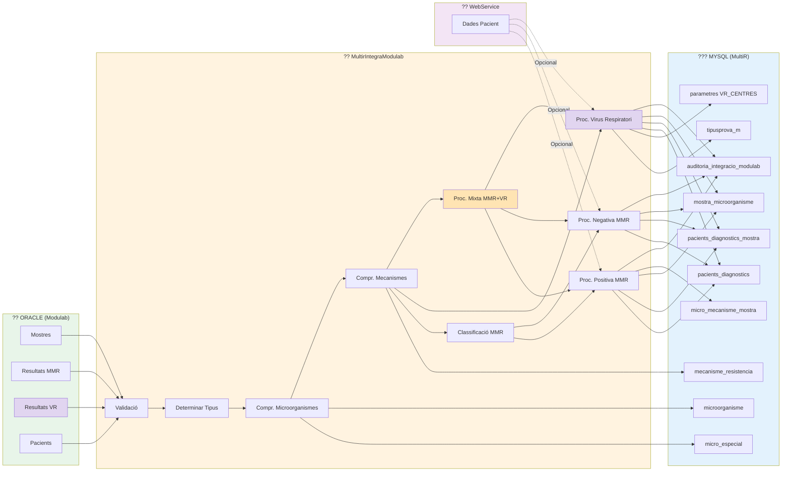

---

## ?? Diagrama 11: Cicle de Vida d'una Mostra (ACTUALITZAT amb VR)

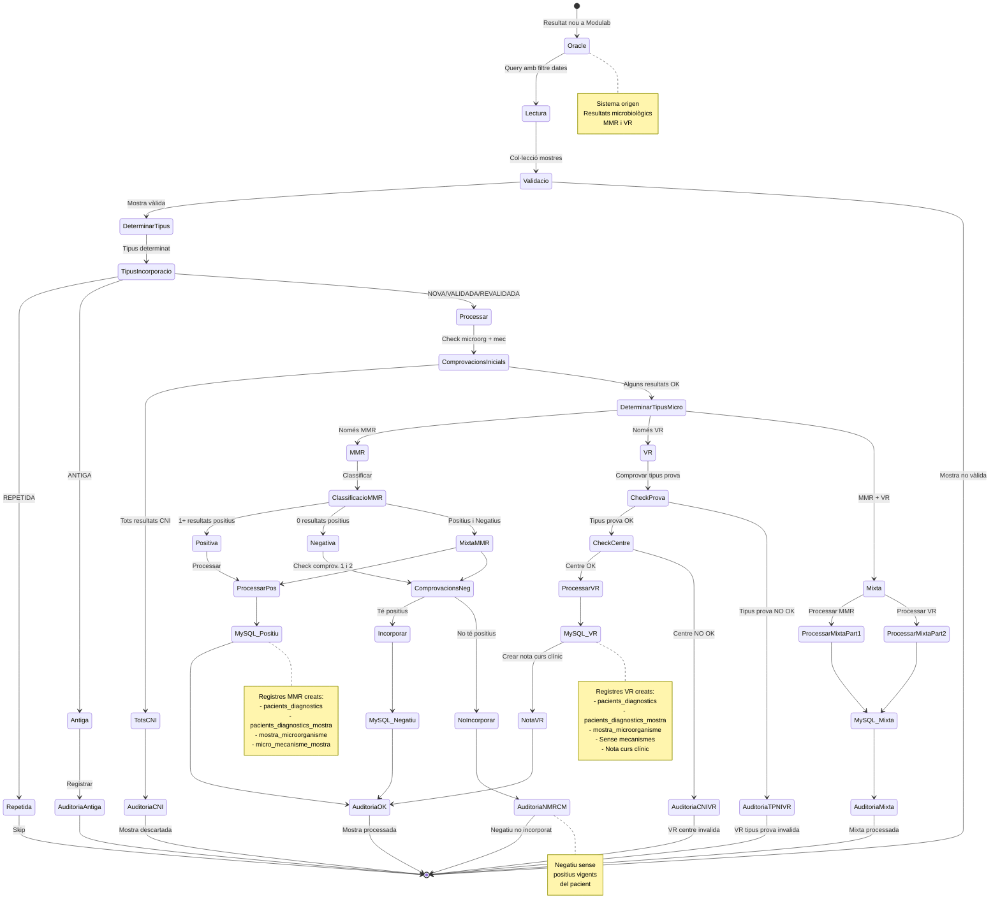

---

## ?? Diagrama 12: Model de Dades Simplificat (ACTUALITZAT)

```mermaid
erDiagram
    PACIENTS_DIAGNOSTICS ||--o{ PACIENTS_DIAGNOSTICS_MOSTRA : "té"
    PACIENTS_DIAGNOSTICS_MOSTRA ||--|| MOSTRA_MICROORGANISME : "genera"
    MOSTRA_MICROORGANISME ||--o{ MICRO_MECANISME_MOSTRA : "té MMR"
    
    MICROORGANISME ||--o{ MOSTRA_MICROORGANISME : "és"
    MICROORGANISME ||--o| MICRO_ESPECIAL : "pot ser"
    
    MECANISME_RESISTENCIA ||--o{ MICRO_MECANISME_MOSTRA : "és"
    MICROORGANISME ||--o{ MICRO_MECANISME_NOINCOPORAR : "té"
    MECANISME_RESISTENCIA ||--o{ MICRO_MECANISME_NOINCOPORAR : "forma"
    
    TIPUSMOSTRA_M ||--o{ PACIENTS_DIAGNOSTICS_MOSTRA : "classifica"
    TIPUSMOSTRA_M ||--o{ TIPUSMOSTRA_EQUIVALENTS : "pot tenir"
    
    TIPUSPROVA_M ||--o{ MOSTRA_MICROORGANISME : "identifica"
    TIPUSPROVA_M ||--o| PARAMETRES : "configura VR"
    
    MOSTRA_MICROORGANISME ||--|| AUDITORIA_INTEGRACIO_MODULAB : "registra"
    
    PACIENTS_DIAGNOSTICS {
        int id PK
        string npat
        datetime data_entrada
        datetime data_modificacio
    }
    
    PACIENTS_DIAGNOSTICS_MOSTRA {
        int id PK
        string npat FK
        datetime data_mostra
        string tipus_mostra_m
        string etiqueta
        char valoracio
        char vigent
    }
    
    MOSTRA_MICROORGANISME {
        int id PK
        string npat
        string etiqueta UK
        datetime data_mostra
        datetime data_resultat
        datetime data_validacio
        string microorganisme FK
        int id_prova FK
    }
    
    MICRO_MECANISME_MOSTRA {
        int id PK
        string npat
        string etiqueta
        datetime data_mostra
        string microorganisme FK
        string mecanisme_resistencia FK
        comment "NULL per VR"
    }
    
    MICROORGANISME {
        int id PK
        string descripcio UK
        tinyint especial
        comment "Inclou MMR i VR"
    }
    
    MICRO_ESPECIAL {
        int id PK
        string microorganisme UK
        comment "Només MMR"
    }
    
    MECANISME_RESISTENCIA {
        int id PK
        string codi UK
        string descripcio
        comment "Només per MMR"
    }
    
    MICRO_MECANISME_NOINCOPORAR {
        int id PK
        string microorganisme FK
        string mecanisme_resistencia FK
        comment "CNI - Només MMR"
    }
    
    TIPUSMOSTRA_M {
        int id PK
        string descripcio UK
        int comportament
        int dies_vigencia_positiu
    }
    
    TIPUSPROVA_M {
        int id PK
        string descripcio UK
        tinyint permet_vr
        comment "Nou camp VR"
    }
    
    PARAMETRES {
        int id PK
        string clau
        string valor
        comment "VR_CENTRES: llista centres VR"
    }
    
    AUDITORIA_INTEGRACIO_MODULAB {
        int id PK
        string etiqueta
        string npat
        string codi_retorn
        datetime data_integracio
        comment "Codis: OK, NPWS, CNI, NMRCM, TPNIVR, CNIVR"
    }
```

---

## ?? Llegenda de Colors i Símbols

### Colors dels Nodes

- ?? **Verd clar** (#e1f5e1): Inici/Fi de flux
- ?? **Verd** (#c8e6c9): Acció exitosa, incorporació
- ?? **Blau** (#e3f2fd): Comprovacions, queries
- ?? **Groc** (#fff3cd): Warnings, situacions especials
- ?? **Taronja** (#ffe4b3): Microorganismes especials / Mostres mixtes
- ?? **Lila** (#e1d5f0): Virus Respiratoris
- ?? **Blau clar** (#d5e8f0): Registres VR
- ?? **Vermell clar** (#ffcdd2): Errors, rebutjos
- ? **Gris** (#f5f5f5): Processos neutrals

### Símbols Utilitzats

- ?? Inici de procés
- ? Validació/Comprovació OK
- ? Error/Rebuig
- ?? Cerca/Query
- ?? Crear/Actualitzar BD
- ?? Auditoria
- ?? Classificació MMR
- ?? Microorganismes / Virus Respiratoris
- ??? Mecanismes
- ? Positiu MMR
- ?? Negatiu MMR
- ?? WebService
- ?? Resultat/Estadística
- ?? Actualització/Revalidació
- ?? Warning
- ?? Mostra mixta MMR+VR
- ?? Determinar tipus

### Codis d'Auditoria

- **OK**: Processament correcte
- **NPWS**: Pacient No trobat al Web Service
- **CNI**: Combinació No Incorporable (microorganisme + mecanisme)
- **NMRCM**: Negatiu sense Microorganisme amb Resistència al Carbapenem vigent
- **TPNIVR**: Tipus de Prova No vàlida per Incorporar Virus Respiratoris
- **CNIVR**: Centre No vàlid per Incorporar Virus Respiratoris

---

## ?? Notes d'Ús

### Visualitzar Diagrames

1. **GitHub**: Els diagrames Mermaid es renderitzen automàticament
2. **VS Code**: Instal·lar extensió "Markdown Preview Mermaid Support"
3. **Online**: Copiar codi a https://mermaid.live/
4. **Exportar**: Des de mermaid.live es pot exportar a PNG, SVG, PDF

### Modificar Diagrames

Els diagrames són text pla i es poden editar fàcilment:

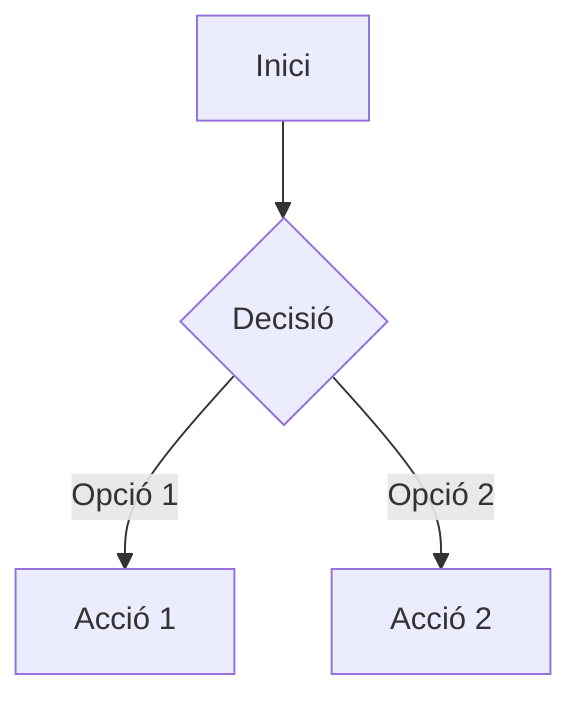

### Sintaxi Bàsica

- `flowchart TD`: Diagrama de flux de dalt a baix (Top-Down)
- `flowchart LR`: Diagrama de flux d'esquerra a dreta (Left-Right)
- `-->`: Fletxa simple
- `-.->`: Fletxa puntejada
- `==>`: Fletxa gruixuda
- `[ ]`: Node rectangular
- `{ }`: Node de decisió (rombe)
- `(( ))`: Node circular
- `[( )]`: Node cilíndric (BD)

---

## ?? Novetats Versió 2.0 (Actualització Gener 2025)

### Funcionalitats Afegides:

1. **Virus Respiratoris (VR)**:
   - Processament específic per VR (sempre positius, sense mecanismes)
   - Validació tipus de prova (`tipusprova_m.permet_vr`)
   - Validació centre (`parametres.VR_CENTRES`)
   - Generació automàtica de nota curs clínic
   - Codis auditoria específics: `TPNIVR`, `CNIVR`

2. **Mostres Mixtes MMR + VR**:
   - Processament separat i coordinat de MMR i VR
   - Bifurcació de flux segons tipus de microorganisme
   - Combinació de resultats finals

3. **Millores en Comprovació Mecanismes**:
   - Eliminació de resultats individuals amb CNI (no tota la mostra)
   - Descart de mostra només si tots els resultats tenen CNI
   - Suport per VR (sense mecanismes)

### Diagrames Nous/Actualitzats:

- **Diagrama 1**: Flux principal amb bifurcació MMR/VR/Mixt ?
- **Diagrama 2**: Classificació MMR (sense canvis) ?
- **Diagrama 3**: **NOVELL** - Flux específic Virus Respiratoris ?
- **Diagrama 4**: **NOVELL** - Flux Mostra Mixta MMR + VR ?
- **Diagrama 5**: Comprovar Microorganismes (renumerat) ?
- **Diagrama 6**: Actualitzat amb lògica eliminació individual CNI ?
- **Diagrama 7**: Processar Positiva MMR (renumerat) ?
- **Diagrama 8**: Processar Negativa (renumerat) ?
- **Diagrama 9**: Determinar Tipus (renumerat) ?
- **Diagrama 10**: Actualitzat amb taules i processos VR ?
- **Diagrama 11**: Cicle de vida amb estats VR i Mixta ?
- **Diagrama 12**: Model dades amb camps VR ?

---

**Documentació actualitzada**: Gener 2025  
**Versió**: 2.0  
**Format**: Mermaid.js  
**Compatibilitat**: GitHub, GitLab, VS Code, Mermaid Live Editor  
**Canvis principals**: Suport complet Virus Respiratoris (VR) i Mostres Mixtes
