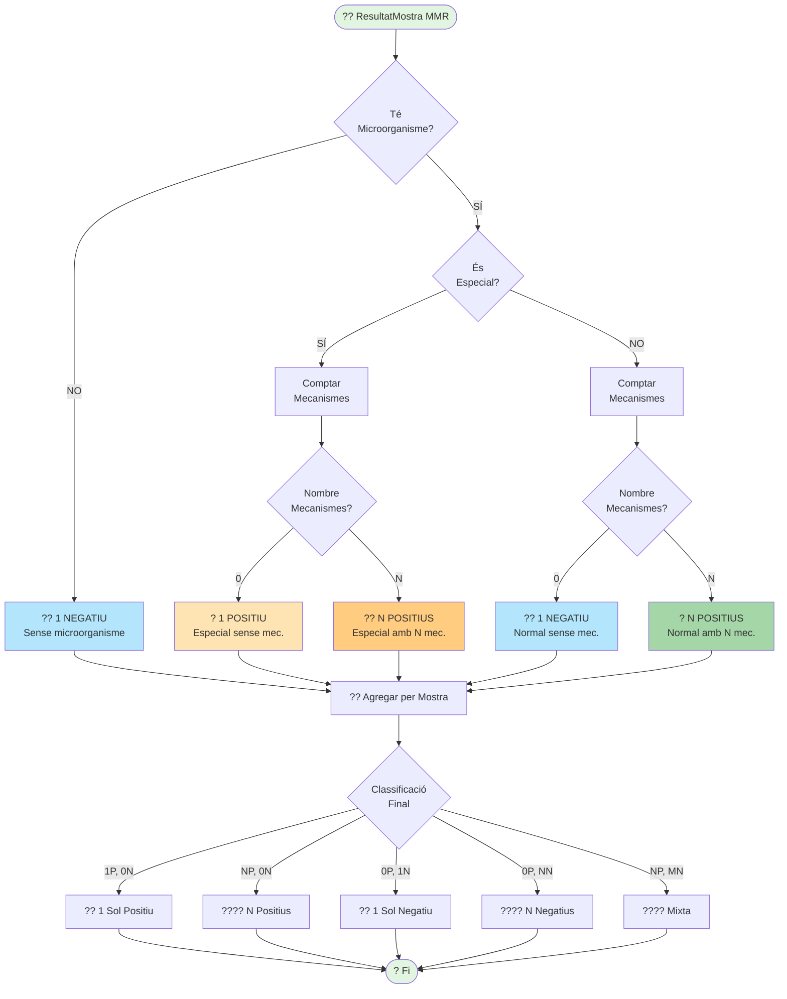

# ?? Diagrama 2: Classificació de Mostra MMR

## Descripció

Aquest diagrama mostra com es classifiquen les mostres MMR (Microorganismes amb Mecanismes de Resistència):

### Criteris de Classificació:

1. **Microorganisme Especial amb mecanismes** ? POSITIU
2. **Microorganisme Especial sense mecanismes** ? POSITIU
3. **Microorganisme Normal amb mecanismes** ? POSITIU
4. **Microorganisme Normal sense mecanismes** ? NEGATIU
5. **Sense microorganisme** ? NEGATIU

### Agregació Final:

- **1 Sol Positiu**: 1 positiu, 0 negatius
- **N Positius**: N positius, 0 negatius
- **1 Sol Negatiu**: 0 positius, 1 negatiu
- **N Negatius**: 0 positius, N negatius
- **Mixta**: N positius, M negatius
