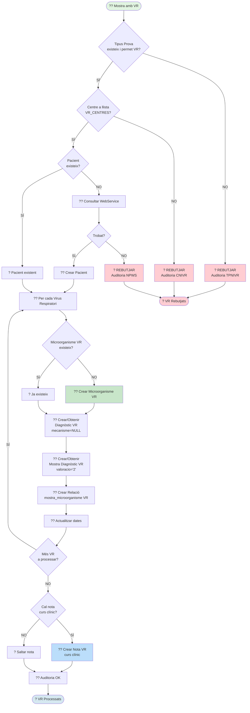

# ?? Diagrama 3: Flux Específic Virus Respiratoris (NOU)

## Descripció

Aquest diagrama mostra el flux específic per processar **Virus Respiratoris (VR)**.

### Característiques específiques dels VR:

- **SEMPRE són positius** (no hi ha VR negatius)
- **NO tenen mecanismes de resistència** (sempre NULL)
- **SEMPRE s'incorporen** (sense comprovacions de comportament com MMR)
- **Processament simplificat** vs MMR

### Validacions VR:

1. **Tipus de Prova**: Ha d'existir a `tipusprova_m` i tenir `permet_vr = 1`
2. **Centre**: Ha d'estar a la llista de paràmetres `VR_CENTRES`
3. **Pacient**: Ha d'existir o poder-se crear des del WebService

### Registres creats:

- `pacients_diagnostics` (si no existeix)
- `pacients_diagnostics_mostra` amb `valoracio='2'` (positiu)
- `mostra_microorganisme` amb `mecanisme = NULL`
- **Nota automàtica** al curs clínic del pacient

### Codis d'auditoria:

- **OK**: Processament correcte
- **TPNIVR**: Tipus de Prova No vàlida per Incorporar VR
- **CNIVR**: Centre No vàlid per Incorporar VR
- **NPWS**: Pacient No trobat al WebService
