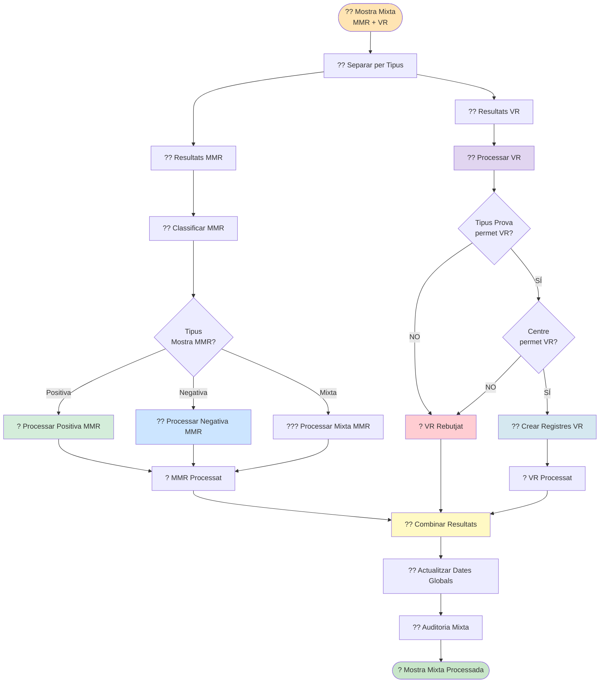

# ?? Diagrama 4: Flux Mostra Mixta MMR + VR (NOU)

## Descripció

Aquest diagrama mostra el flux per processar mostres **Mixtes** que contenen tant **MMR** com **VR**.

### Estratègia de Processament:

1. **Separació inicial** dels resultats per tipus de microorganisme
2. **Processament independent**:
   - Part **MMR**: Segueix el flux normal de classificació MMR
   - Part **VR**: Segueix el flux específic de VR amb les seves validacions
3. **Combinació de resultats** finals
4. **Actualització de dates** globals del pacient
5. **Auditoria mixta** que reflecteix ambdós processaments

### Possibles Escenaris:

- **MMR Positiva + VR Positiu** ? Tots processats
- **MMR Negativa + VR Positiu** ? Negativa pot no incorporar-se segons comprovacions
- **MMR Positiva + VR Rebutjat** ? Només MMR processada
- **MMR Mixta + VR Positiu** ? Processament complex amb múltiples registres

### Avantatges:

- **Processament independent** evita conflictes
- **Flexibilitat** per gestionar errors parcials
- **Auditoria completa** de tot el processament
- **Dates actualitzades** correctament per ambdós tipus
