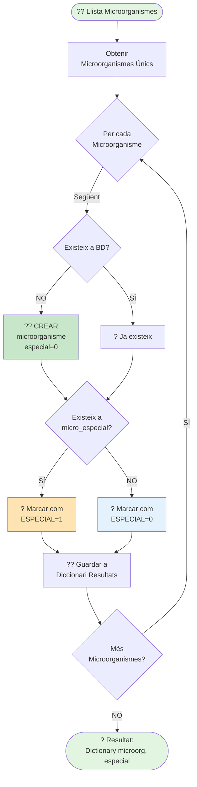

# ?? Diagrama 5: Comprovar Microorganismes

## Descripció

Aquest diagrama mostra el procés de **comprovació i marcatge de microorganismes**.

### Flux de Comprovació:

1. **Obtenir microorganismes únics** de la llista
2. Per cada microorganisme:
   - **Comprovar si existeix** a la taula `microorganisme`
   - Si **NO existeix**: Crear amb `especial = 0`
   - Si **SÍ existeix**: Continuar
3. **Comprovar si és especial**:
   - Consultar taula `micro_especial`
   - Si existeix ? Marcar `especial = 1`
   - Si no existeix ? Marcar `especial = 0`
4. **Guardar en diccionari** de resultats
5. **Retornar** diccionari complet: `{ microorganisme: especial }`

### Taules Implicades:

- **`microorganisme`**: Taula principal de microorganismes
  - `id` (PK)
  - `descripcio` (UK)
  - `especial` (tinyint: 0/1)

- **`micro_especial`**: Llista de microorganismes especials
  - `id` (PK)
  - `microorganisme` (UK)

### Ús del Resultat:

El diccionari retornat s'utilitza posteriorment per:
- **Classificar** resultats com a positius o negatius
- **Determinar** si cal crear registres de diagnòstic
- **Aplicar lògica** específica segons el tipus de microorganisme
