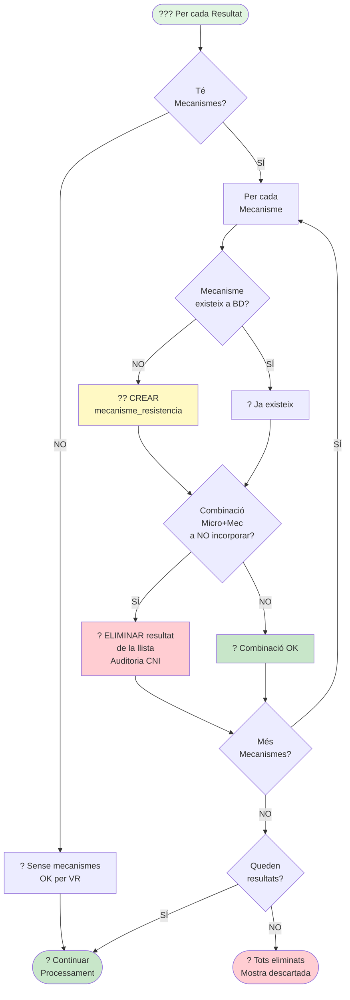

# ??? Diagrama 6: Comprovació Mecanismes (ACTUALITZAT)

## Descripció

Aquest diagrama mostra el procés de **comprovació de mecanismes de resistència** i detecció de **combinacions no incorporables (CNI)**.

### Novetats (Actualització VR):

- **Suport per VR**: Si no hi ha mecanismes ? OK (cas VR)
- **Eliminació individual**: Només s'elimina el resultat amb CNI, no tota la mostra
- **Comprovació final**: Si tots els resultats tenen CNI ? mostra descartada

### Flux de Comprovació:

1. **Comprovar si té mecanismes**:
   - **NO** ? OK (cas típic de VR)
   - **SÍ** ? Processar cada mecanisme

2. Per cada mecanisme:
   - **Comprovar existència** a `mecanisme_resistencia`
   - Si **NO existeix** ? Crear
   - **Consultar** taula `micro_mecanisme_noincoporar`
   - Si **combinació prohibida (CNI)**:
     - Eliminar el resultat de la llista
     - Registrar auditoria CNI
   - Si **combinació OK** ? Continuar

3. **Comprovació final**:
   - Si **queden resultats** ? Continuar processament
   - Si **NO queden resultats** ? Mostra descartada

### Taules Implicades:

- **`mecanisme_resistencia`**: Llista de mecanismes
  - `id` (PK)
  - `codi` (UK)
  - `descripcio`

- **`micro_mecanisme_noincoporar`**: Combinacions prohibides (CNI)
  - `id` (PK)
  - `microorganisme` (FK)
  - `mecanisme_resistencia` (FK)

### Exemples de CNI:

Combinacions microorganisme + mecanisme que **NO** s'han d'incorporar per motius clínics o epidemiològics.
