# ? Diagrama 7: Processar Mostra Positiva MMR

```mermaid
flowchart TD
    Start([? Mostra Positiva MMR]) --> GetPatient[?? Obtenir Pacient<br/>WebService]
    
    GetPatient --> PatientFound{Pacient<br/>Trobat?}
    
    PatientFound -->|NO| Warning[?? Warning<br/>Pacient no trobat<br/>Continuar igualment]
    PatientFound -->|SÍ| CheckPD
    
    Warning --> CheckPD{Pacient existeix a<br/>pacients_diagnostics?}
    
    CheckPD -->|NO| CreatePD[?? INSERT<br/>pacients_diagnostics]
    CheckPD -->|SÍ| ExistsPD[? Ja existeix]
    
    CreatePD --> LoopResults
    ExistsPD --> LoopResults[?? Per cada resultat POSITIU MMR]
    
    LoopResults --> CreatePDM[?? CREATE/UPDATE<br/>pacients_diagnostics_mostra<br/>valoracio='2']
    
    CreatePDM --> CreateMM[?? CREATE<br/>mostra_microorganisme]
    
    CreateMM --> HasMech{Té<br/>Mecanismes?}
    
    HasMech -->|SÍ| CreateMech[?? CREATE<br/>micro_mecanisme_mostra<br/>per cada mecanisme 1-5]
    HasMech -->|NO| CheckTypes
    
    CreateMech --> CheckTypes{Tipus Mostra/Prova<br/>existeixen?}
    
    CheckTypes -->|NO| CreateTypes[?? CREATE<br/>tipusmostra_m<br/>tipusprova_m]
    CheckTypes -->|SÍ| UpdateDates
    
    CreateTypes --> UpdateDates[?? Actualitzar Dates Pacient<br/>última inclusió<br/>última mostra positiva]
    
    UpdateDates --> MoreResults{Més resultats<br/>positius?}
    
    MoreResults -->|SÍ| LoopResults
    MoreResults -->|NO| Audit[?? Auditoria<br/>Codi: OK]
    
    Audit --> Result([? Resultat OK])
    
    style Start fill:#e1f5e1
    style Result fill:#c8e6c9
    style Warning fill:#fff3cd
    style Audit fill:#d1ecf1
```

## Descripció

Aquest diagrama mostra el procés de **processament de mostres positives MMR**.

### Característiques:

- Les **mostres positives SEMPRE s'incorporen** (sense comprovacions de comportament)
- Poden tenir **1 o N resultats positius**
- Cada resultat es processa individualment

### Flux de Processament:

1. **Obtenir/Crear Pacient**:
   - Consultar WebService si no existeix
   - Si no es troba ? Warning però continuar
   - Crear registre a `pacients_diagnostics` si cal

2. **Per cada resultat positiu**:
   - Crear/Actualitzar `pacients_diagnostics_mostra` amb `valoracio='2'` (positiu)
   - Crear `mostra_microorganisme`
   - Si té mecanismes ? Crear `micro_mecanisme_mostra` (1-5 mecanismes)
   - Comprovar/Crear tipus mostra i tipus prova
   - Actualitzar dates del pacient:
     - Data última inclusió
     - Data última mostra positiva

3. **Auditoria** amb codi **OK**

### Registres Creats:

- `pacients_diagnostics` (si no existeix)
- `pacients_diagnostics_mostra` (sempre)
- `mostra_microorganisme` (sempre)
- `micro_mecanisme_mostra` (si té mecanismes, 1-5 registres)
- `tipusmostra_m` (si no existeix)
- `tipusprova_m` (si no existeix)
- `auditoria_integracio_modulab` (sempre)

### Valoracions:

- `valoracio='2'` ? Positiu
- `vigent='S'` ? Vigent
