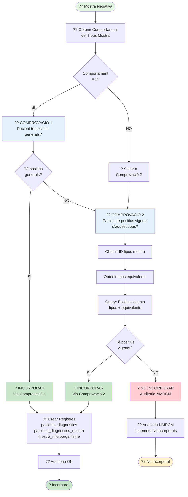

# ?? Diagrama 8: Processar Mostra Negativa (Comprovacions)

## Descripció

Aquest diagrama mostra el procés de **processament de mostres negatives MMR** amb les seves **comprovacions** per determinar si s'incorporen.

### Comprovacions:

Les mostres negatives **NO sempre s'incorporen**. Cal comprovar:

#### **COMPROVACIÓ 1** (només si `comportament = 1`):
- **Pregunta**: El pacient té positius generals (especials amb mecanismes)?
- **Si SÍ** ? Incorporar la mostra negativa
- **Si NO** ? Passar a Comprovació 2

#### **COMPROVACIÓ 2** (sempre):
- **Pregunta**: El pacient té positius vigents d'aquest tipus de mostra (o equivalents)?
- **Passos**:
  1. Obtenir ID del tipus de mostra
  2. Obtenir tipus equivalents (taula `tipusmostra_equivalents`)
  3. Query: Buscar positius vigents del tipus o equivalents
- **Si SÍ** ? Incorporar la mostra negativa
- **Si NO** ? **NO incorporar** (Auditoria **NMRCM**)

### Comportament Tipus Mostra:

- **`comportament = 1`**: Fa Comprovació 1 + Comprovació 2
- **`comportament ? 1`**: Només fa Comprovació 2

### Registres Creats (si s'incorpora):

- `pacients_diagnostics` (si no existeix)
- `pacients_diagnostics_mostra` amb `valoracio='0'` (negatiu)
- `mostra_microorganisme` sense mecanismes
- `auditoria_integracio_modulab` amb codi **OK**

### Codi Auditoria:

- **OK**: Negatiu incorporat (passa alguna comprovació)
- **NMRCM**: Negatiu sense Microorganisme amb Resistència al Carbapenem vigent (no incorporat)
