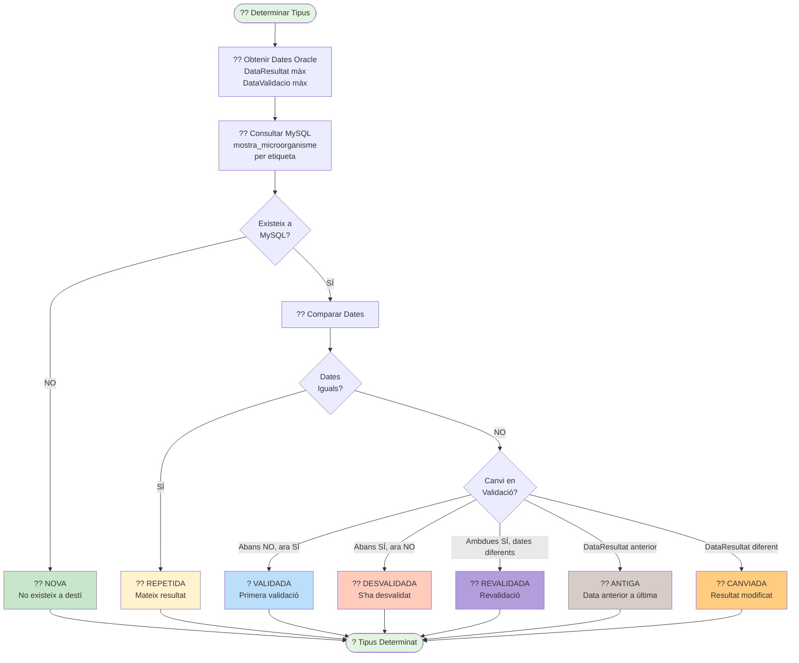

# ?? Diagrama 9: Determinar Tipus Incorporació

## Descripció

Aquest diagrama mostra el procés de **determinació del tipus d'incorporació** d'una mostra.

### Tipus d'Incorporació:

#### ?? **NOVA**
- La mostra **NO existeix** a MySQL
- És la **primera** vegada que es processa
- **Acció**: Processar normalment

#### ?? **REPETIDA**
- La mostra **existeix** amb les **mateixes dates**
- Mateix `data_resultat` i `data_validacio`
- **Acció**: **SKIP** (no processar)

#### ? **VALIDADA**
- La mostra existia **sense data validació**
- Ara **té data validació**
- És la **primera validació**
- **Acció**: Processar com a validada

#### ?? **DESVALIDADA**
- La mostra tenia **data validació**
- Ara **NO té data validació**
- S'ha **desvalidat** el resultat
- **Acció**: Processar com a desvalidada

#### ?? **REVALIDADA**
- La mostra tenia **data validació**
- Ara té **data validació diferent**
- **Acció**: Processar com a revalidada

#### ?? **ANTIGA**
- `data_resultat` és **anterior** a l'última registrada
- Resultat **fora d'ordre temporal**
- **Acció**: Registrar a auditoria, no processar

#### ?? **CANVIADA**
- `data_resultat` és **diferent** (no anterior)
- El resultat s'ha **modificat**
- **Acció**: Processar com a canviada

### Flux de Decisió:

1. **Consultar MySQL** per etiqueta
2. **Si NO existeix** ? **NOVA**
3. **Si existeix**:
   - Comparar dates `data_resultat` i `data_validacio`
   - **Dates iguals** ? **REPETIDA**
   - **Dates diferents** ? Analitzar canvi:
     - Canvi validació ? **VALIDADA / DESVALIDADA / REVALIDADA**
     - Canvi data resultat ? **ANTIGA / CANVIADA**

### Processament Posterior:

- **NOVA, VALIDADA, REVALIDADA** ? Processar completament
- **REPETIDA** ? Skip (no processar)
- **ANTIGA** ? Auditoria només
- **DESVALIDADA, CANVIADA** ? Processar segons lògica específica
