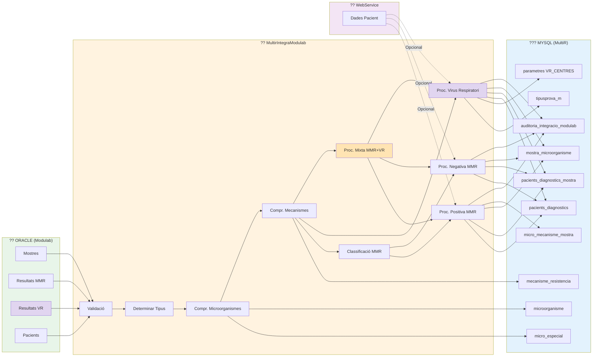

# ?? Diagrama 10: Flux de Dades entre Sistemes (ACTUALITZAT)

## Descripció

Aquest diagrama mostra el **flux de dades** entre els diferents **sistemes** involucrats en el processament.

### Sistemes Principals:

#### ?? **ORACLE (Modulab)** - Sistema Origen
- **Mostres**: Informació de les mostres
- **Resultats MMR**: Microorganismes amb mecanismes de resistència
- **Resultats VR**: Virus respiratoris
- **Pacients**: Informació bàsica de pacients

#### ?? **MultirIntegraModulab** - Aplicació de Processament
- **Validació**: Valida dades bàsiques
- **Determinar Tipus**: NOVA, REPETIDA, VALIDADA, etc.
- **Classificació MMR**: Positiva, Negativa, Mixta
- **Comprovació Microorganismes**: Especials vs Normals
- **Comprovació Mecanismes**: CNI detection
- **Processament Específic**:
  - MMR Positiva
  - MMR Negativa
  - Virus Respiratori
  - Mixta MMR+VR

#### ??? **MySQL (MultiR)** - Base de Dades Destí
- **Taules Principals**:
  - `pacients_diagnostics`: Pacients amb diagnòstics
  - `pacients_diagnostics_mostra`: Mostres per pacient
  - `mostra_microorganisme`: Relació mostra-microorganisme
  - `micro_mecanisme_mostra`: Mecanismes per mostra
  
- **Taules de Referència**:
  - `microorganisme`: Catàleg de microorganismes
  - `micro_especial`: Microorganismes especials
  - `mecanisme_resistencia`: Catàleg de mecanismes
  - `tipusprova_m`: Tipus de proves (amb `permet_vr`)
  - `parametres`: Configuració (VR_CENTRES)
  
- **Auditoria**:
  - `auditoria_integracio_modulab`: Registre de totes les integracions

#### ?? **WebService SAP** - Servei Extern (Opcional)
- **Dades Pacient**: Informació completa del pacient
- **Connexió**: Opcional, si el pacient no existeix

### Flux de Dades:

1. **Oracle ? App**: Lectura de mostres i resultats
2. **App ? MySQL**: Escriptura de diagnòstics i mostres
3. **WebService -.-> App**: Consulta opcional de pacients
4. **App ? Auditoria**: Registre de totes les operacions

### Novetats VR:

- **Resultats VR** separats dels MMR
- **Validació específica**: `tipusprova_m.permet_vr` i `parametres.VR_CENTRES`
- **Sense mecanismes**: VR no crea registres a `micro_mecanisme_mostra`
- **Nota automàtica**: Creació de nota al curs clínic
