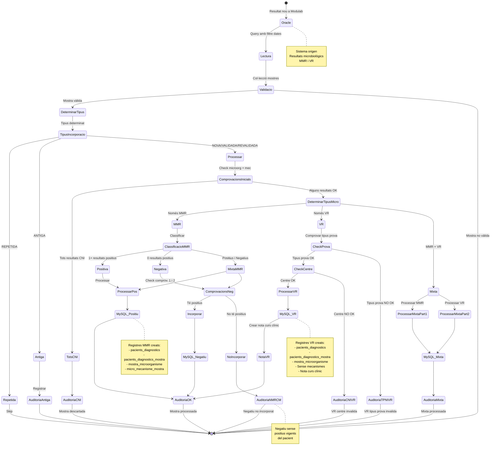

# ?? Diagrama 11: Cicle de Vida d'una Mostra (ACTUALITZAT amb VR)

## Descripció

Aquest diagrama mostra el **cicle de vida complet** d'una mostra des que arriba d'Oracle fins que es processa o es descarta.

### Estats Principals:

#### 1?? **Lectura i Validació**
- Lectura d'Oracle amb filtre de dates
- Validació de dades bàsiques
- Si no vàlida ? Descartada

#### 2?? **Determinació Tipus**
- **NOVA**: Primera vegada
- **REPETIDA**: Ja processada ? Skip
- **VALIDADA**: Primera validació ? Processar
- **REVALIDADA**: Revalidació ? Processar
- **ANTIGA**: Data anterior ? Auditoria només

#### 3?? **Comprovacions Inicials**
- Microorganismes (especials vs normals)
- Mecanismes (detecció CNI)
- Si tots CNI ? Mostra descartada

#### 4?? **Determinació Tipus Microorganisme**
- **MMR**: Només microorganismes amb mecanismes
- **VR**: Només virus respiratoris
- **Mixta**: Combinació MMR + VR

#### 5?? **Processament MMR**
- **Classificació**: Positiva / Negativa / Mixta
- **Positiva**: Sempre s'incorpora
- **Negativa**: Comprovacions 1 i 2
  - Si té positius vigents ? Incorporar
  - Si no té positius vigents ? NO incorporar (NMRCM)

#### 6?? **Processament VR**
- **Validació Tipus Prova**: Ha de permetre VR (TPNIVR)
- **Validació Centre**: Ha d'estar a VR_CENTRES (CNIVR)
- **Processament**: Sempre positiu, sense mecanismes
- **Nota Automàtica**: Creació al curs clínic

#### 7?? **Processament Mixta**
- Processament independent de part MMR i part VR
- Combinació de resultats finals
- Auditoria mixta

#### 8?? **Estats Finals**
- **Mostra processada** (OK)
- **Negatiu no incorporat** (NMRCM)
- **Mixta processada** (OK)
- **VR tipus prova invalida** (TPNIVR)
- **VR centre invalida** (CNIVR)
- **Mostra descartada** (CNI)

### Diferències MMR vs VR:

| Característica | MMR | VR |
|---|---|---|
| Mecanismes | Sí (1-5) | No (NULL) |
| Comprovacions Negatius | Sí (Comprov. 1 i 2) | No (sempre positius) |
| Validació Específica | No | Sí (Tipus Prova + Centre) |
| Nota Curs Clínic | No | Sí (automàtica) |
