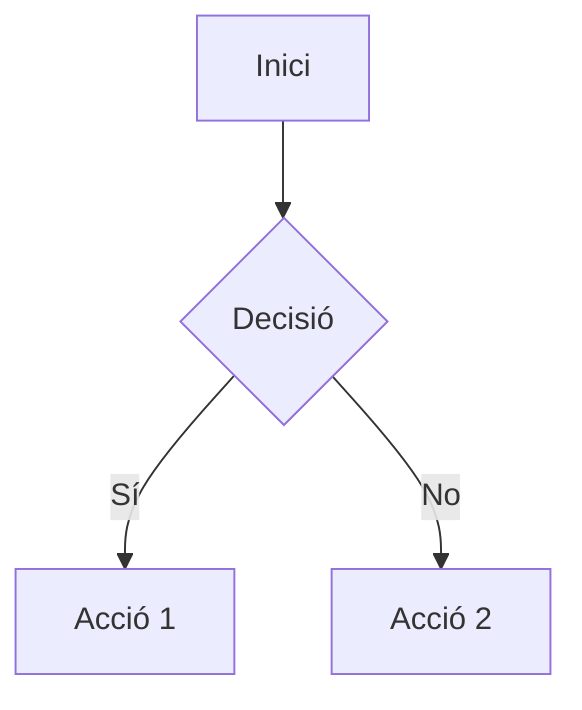
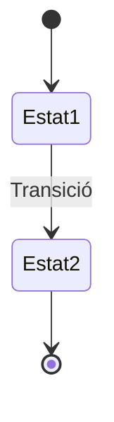
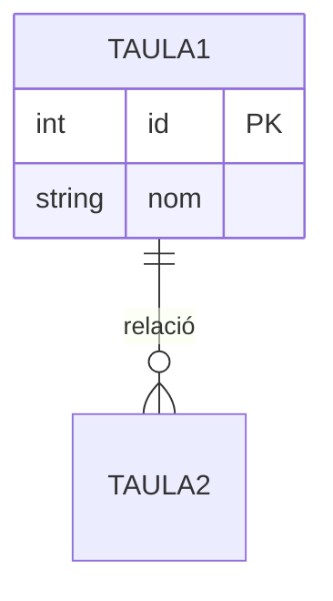

# ?? DIAGRAMES DE FLUX - MultirIntegraModulab

Aquest directori conté els **diagrames de flux** del sistema MultirIntegraModulab en format **Mermaid**.

## ?? Estructura

Cada diagrama està en un fitxer separat per facilitar la consulta i el manteniment:

### ?? Flux General

1. **[01_Flux_Principal.md](01_Flux_Principal.md)** ??
   - Flux principal complet amb suport MMR + VR
   - Validació, determinació tipus, bifurcacions
   - Processos específics per MMR i VR

### ?? Classificació i Tipus

2. **[02_Classificacio_MMR.md](02_Classificacio_MMR.md)** ??
   - Classificació de mostres MMR
   - Positius, negatius, mixtes

3. **[09_Determinar_Tipus.md](09_Determinar_Tipus.md)** ??
   - Determinació tipus d'incorporació
   - NOVA, REPETIDA, VALIDADA, REVALIDADA, ANTIGA

### ?? Virus Respiratoris (NOU)

3. **[03_Flux_Virus_Respiratoris.md](03_Flux_Virus_Respiratoris.md)** ??
   - Flux específic per Virus Respiratoris
   - Validacions tipus prova i centre
   - Sempre positius, sense mecanismes

4. **[04_Flux_Mostra_Mixta.md](04_Flux_Mostra_Mixta.md)** ??
   - Mostres amb MMR + VR
   - Processament separat i combinació

### ?? Comprovacions

5. **[05_Comprovar_Microorganismes.md](05_Comprovar_Microorganismes.md)** ??
   - Comprovar i marcar microorganismes
   - Especials vs Normals

6. **[06_Comprovacio_Mecanismes.md](06_Comprovacio_Mecanismes.md)** ???
   - Comprovació mecanismes de resistència
   - Detecció CNI (Combinacions No Incorporables)

### ? Processament Específic

7. **[07_Processar_Positiva_MMR.md](07_Processar_Positiva_MMR.md)** ?
   - Processament mostres positives MMR
   - Creació registres diagnòstics

8. **[08_Processar_Negativa.md](08_Processar_Negativa.md)** ??
   - Processament mostres negatives
   - Comprovacions 1 i 2 per incorporar

### ?? Vistes Globals

10. **[10_Flux_Dades_Sistemes.md](10_Flux_Dades_Sistemes.md)** ??
    - Flux de dades entre sistemes
    - Oracle, MySQL, WebService

11. **[11_Cicle_Vida_Mostra.md](11_Cicle_Vida_Mostra.md)** ??
    - Cicle de vida complet d'una mostra
    - Estats i transicions

12. **[12_Model_Dades.md](12_Model_Dades.md)** ??
    - Model de dades simplificat
    - Entitats i relacions

---

## ?? Guia Ràpida

### Per entendre el flux general:
1. Comença per **01_Flux_Principal.md** 
2. Després **11_Cicle_Vida_Mostra.md**
3. Finalment **10_Flux_Dades_Sistemes.md**

### Per MMR (Microorganismes amb Mecanismes):
1. **02_Classificacio_MMR.md**
2. **05_Comprovar_Microorganismes.md**
3. **06_Comprovacio_Mecanismes.md**
4. **07_Processar_Positiva_MMR.md**
5. **08_Processar_Negativa.md**

### Per Virus Respiratoris (VR):
1. **03_Flux_Virus_Respiratoris.md**
2. **04_Flux_Mostra_Mixta.md** (si és mixta amb MMR)

### Per Model de Dades:
1. **12_Model_Dades.md**

---

## ??? Com Visualitzar els Diagrames

### 1. GitHub
Els diagrames Mermaid es renderitzen automàticament a GitHub. Simplement obre qualsevol fitxer `.md`.

### 2. VS Code
Instal·la l'extensió **"Markdown Preview Mermaid Support"**:
```
ext install bierner.markdown-mermaid
```

### 3. Mermaid Live Editor
- Obre https://mermaid.live/
- Copia el codi del diagrama
- Visualitza i exporta (PNG, SVG, PDF)

### 4. Exportar a Imatge
Desde https://mermaid.live/ pots exportar els diagrames a:
- **PNG**: Per presentacions
- **SVG**: Per documentació web
- **PDF**: Per documentació impresa

---

## ?? Sintaxi Mermaid

### Tipus de Diagrames Utilitzats:

#### Flowchart (Diagrama de Flux)


#### State Diagram (Diagrama d'Estats)


#### ER Diagram (Model Entitat-Relació)


#### Graph (Graf de Dades)


---

## ?? Llegenda de Colors

- ?? **Verd clar** (#e1f5e1): Inici/Fi de flux
- ?? **Verd** (#c8e6c9): Acció exitosa, incorporació
- ?? **Blau** (#e3f2fd): Comprovacions, queries
- ?? **Groc** (#fff3cd): Warnings, situacions especials
- ?? **Taronja** (#ffe4b3): Microorganismes especials / Mostres mixtes
- ?? **Lila** (#e1d5f0): Virus Respiratoris
- ?? **Blau clar** (#d5e8f0): Registres VR
- ?? **Vermell clar** (#ffcdd2): Errors, rebutjos

---

## ?? Símbols Utilitzats

- ?? Inici de procés
- ? Validació/Comprovació OK
- ? Error/Rebuig
- ?? Cerca/Query
- ?? Crear/Actualitzar BD
- ?? Auditoria
- ?? Classificació MMR
- ?? Microorganismes / Virus Respiratoris
- ??? Mecanismes
- ? Positiu MMR
- ?? Negatiu MMR
- ?? WebService
- ?? Resultat/Estadística
- ?? Actualització/Revalidació
- ?? Warning
- ?? Mostra mixta MMR+VR
- ?? Determinar tipus

---

## ?? Codis d'Auditoria

| Codi | Descripció |
|------|------------|
| **OK** | Processament correcte |
| **NPWS** | Pacient No trobat al Web Service |
| **CNI** | Combinació No Incorporable (microorganisme + mecanisme) |
| **NMRCM** | Negatiu sense Microorganisme amb Resistència al Carbapenem vigent |
| **TPNIVR** | Tipus de Prova No vàlida per Incorporar Virus Respiratoris |
| **CNIVR** | Centre No vàlid per Incorporar Virus Respiratoris |

---

## ?? Novetats Versió 2.0 (Gener 2025)

### Funcionalitats Afegides:

1. **Virus Respiratoris (VR)**:
   - Processament específic per VR (sempre positius, sense mecanismes)
   - Validació tipus de prova (`tipusprova_m.permet_vr`)
   - Validació centre (`parametres.VR_CENTRES`)
   - Generació automàtica de nota curs clínic
   - Codis auditoria específics: `TPNIVR`, `CNIVR`

2. **Mostres Mixtes MMR + VR**:
   - Processament separat i coordinat de MMR i VR
   - Bifurcació de flux segons tipus de microorganisme
   - Combinació de resultats finals

3. **Millores en Comprovació Mecanismes**:
   - Eliminació de resultats individuals amb CNI (no tota la mostra)
   - Descart de mostra només si tots els resultats tenen CNI
   - Suport per VR (sense mecanismes)

### Diagrames Nous:

- **Diagrama 3**: Flux específic Virus Respiratoris ?
- **Diagrama 4**: Flux Mostra Mixta MMR + VR ?

### Diagrames Actualitzats:

- **Diagrama 1**: Flux principal amb bifurcació MMR/VR/Mixt ??
- **Diagrama 6**: Lògica eliminació individual CNI ??
- **Diagrama 10**: Flux dades amb taules i processos VR ??
- **Diagrama 11**: Cicle de vida amb estats VR i Mixta ??
- **Diagrama 12**: Model dades amb camps VR ??

---

**Documentació creada**: Gener 2025  
**Versió**: 2.0  
**Format**: Mermaid.js  
**Codificació**: UTF-8  
**Compatibilitat**: GitHub, GitLab, VS Code, Mermaid Live Editor  
**Canvis principals**: Suport complet Virus Respiratoris (VR) i Mostres Mixtes
