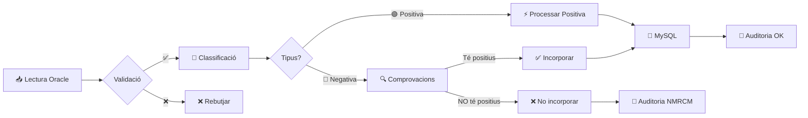

# ⚡ Guia Ràpida (15 minuts)

> **Objectiu**: Entendre els conceptes bàsics de MultirIntegraModulab i el seu funcionament en menys de 15 minuts.

---

## 🎯 Què és MultirIntegraModulab?

**MultirIntegraModulab** és un sistema d'integració automàtica que transfereix resultats microbiològics des d'**Oracle (Modulab)** cap a **MySQL (MultiR)** per a la vigilància epidemiològica.

```
┌─────────────┐                    ┌──────────────┐                    ┌─────────────┐
│   ORACLE    │ ──── Lectura ───►  │   .NET App   │ ──── Insert ───►  │    MYSQL    │
│  (Modulab)  │                    │  Integració  │                    │  (MultiR)   │
└─────────────┘                    └──────────────┘                    └─────────────┘
 Laboratori                        Processament                      Vigilància Epid.
```

---

## 🔑 Conceptes Clau

### 1. 🟢 Mostres POSITIVES

**Definició**: Microorganismes amb rellevància epidemiològica.

**Criteris**:
- Microorganisme **especial** (MRSA, VRE, etc.)
- **O** microorganisme amb **mecanismes de resistència** (BLEE, KPC, etc.)

**Acció**: S'incorporen **sempre** (excepte combinacions prohibides)

**Exemples**:
```
✅ MRSA (microorganisme especial)
✅ E.coli amb BLEE (mecanisme de resistència)
✅ Klebsiella pneumoniae amb carbapenemasa
```

---

### 2. 🔵 Mostres NEGATIVES

**Definició**: Resultats sense rellevància epidemiològica immediata.

**Criteris**:
- Microorganisme **NO especial** sense mecanismes
- **O** sense creixement microbiològic

**Acció**: S'incorporen **només si** el pacient té positius vigents

**Exemples**:
```
🔵 Frotis rectal sense creixement
🔵 E.coli sense mecanismes de resistència
🔵 Flora habitual
```

---

## 📊 Flux Bàsic de Processament



**7 Fases**:
1. ✅ **Validació** - Verificar dades mínimes
2. 🧪 **Classificació** - Positiva, negativa o mixta
3. 🔎 **Tipus Incorporació** - Nova, repetida, validada...
4. 🦠 **Microorganismes** - Verificar/crear
5. 🛡️ **Mecanismes** - Verificar/crear i comprovar combinacions
6. ⚡/🔍 **Processar** - Positiva o negativa
7. 📝 **Auditoria** - Traçabilitat completa

---

## 💡 Exemple Pràctic

### Cas: Pacient amb MRSA

```
📥 ENTRADA (Oracle):
   • Etiqueta: ETQ001234
   • Pacient: 12345678
   • Mostra: Frotis rectal
   • Microorganisme: MRSA
   • Mecanismes: Cap
   • Data: 2025-01-21

📋 PROCESSAMENT:
   1. ✅ Validació → OK
   2. 🧪 Classificació → 1 POSITIU (MRSA és especial)
   3. 🔎 Tipus → NOVA (no existeix a MySQL)
   4. 🦠 Microorganismes → MRSA existeix i és ESPECIAL
   5. 🛡️ Mecanismes → No té mecanismes
   6. ⚡ Processar Positiva:
      └─ Crear pacients_diagnostics
      └─ Crear pacients_diagnostics_mostra
      └─ Crear mostra_microorganisme
   7. 📝 Auditoria → Codi: OK

📤 SORTIDA (MySQL):
   ✅ Mostra incorporada correctament
   🔔 Alerta epidemiològica activada
```

---

## 🔍 Comprovacions per Negatius

Les mostres negatives passen per 2 comprovacions:

### Comprovació 1: Positius Generals
```
SI tipus_mostra.comportament = 1
   I pacient té algun positiu general
   → ✅ INCORPORAR
```

### Comprovació 2: Positius Vigents
```
SI pacient té positius vigents
   del mateix tipus de mostra (o equivalents)
   → ✅ INCORPORAR
SINÓ
   → ❌ NO INCORPORAR (Auditoria NMRCM)
```

---

## 📈 Resultats i Auditoria

### Codis d'Auditoria

| Codi | Significat | Descripció |
|------|-----------|------------|
| **OK** | ✅ Èxit | Mostra processada correctament |
| **CNI** | 🚫 Combinació No Incorporar | Micro+Mecanisme prohibit |
| **NMRCM** | ⚠️ No Mostra Resultats | Negatiu sense positius vigents |
| **ERROR** | ❌ Error | Excepció durant processament |

### Exemple de Resultat

```
📊 RESUM D'EXECUCIÓ
══════════════════════════════════════════════════
📥 Total mostres llegides:        50
✅ Total processades:             48
   └─ 🟢 Positius:                 30
   └─ 🔵 Negatius incorporats:     18
      ├─ Via Comprovació 1:         8
      └─ Via Comprovació 2:        10
❌ No incorporades (NMRCM):         2
🚫 Errors:                          0
⏱️  Temps d'execució:              3 min 24 seg
══════════════════════════════════════════════════
```

---

## 🎓 Termes Essencials

| Terme | Definició |
|-------|-----------|
| **MRSA** | Staphylococcus aureus resistent a meticilina |
| **BLEE** | Betalactamasa d'espectre estès |
| **Vigència** | Període en què un positiu es considera actiu (90-365 dies) |
| **Comportament** | Atribut del tipus de mostra (0 o 1) |
| **Tipus Equivalent** | Tipus de mostra similars (ex: Sang venosa ≈ Sang arterial) |

---

## ✅ Has Après

Després d'aquesta guia ràpida, hauries de saber:

- [x] Què és MultirIntegraModulab i per a què serveix
- [x] Diferència entre mostres positives i negatives
- [x] Flux bàsic de processament (7 fases)
- [x] Comprovacions per a negatius
- [x] Codis d'auditoria principals
- [x] Interpretar un resultat d'execució

---

## 🚀 Següents Passos

### Aprofundir
- [📚 Resum Executiu](../overview/RESUM_EXECUTIU.md) - Visió completa del sistema
- [🔧 Documentació Tècnica](../technical/PROCES_CAPTACIO_DADES.md) - Detall de les 7 fases
- [📊 Diagrames Interactius](../technical/DIAGRAMES_FLUX_MERMAID.md) - Visualització dels fluxos

### Practicar
- [📝 Primers Passos](first-steps.md) - Tutorial pràctic
- [💡 Exemples](../examples/use-cases.md) - Més casos d'ús
- [🧪 Tutorials](../tutorials/index.md) - Tasques específiques

### Implementar
- [🔧 Instal·lació](installation.md) - Configurar l'aplicació
- [👨‍💻 Guia Desenvolupador](../guides/developer-guide.md) - Per desenvolupadors
- [🎨 Guia Analista](../guides/analyst-guide.md) - Per analistes

---

## 💬 Preguntes Freqüents

<details>
<summary><strong>Què passa si una mostra ja existeix a MySQL?</strong></summary>

El sistema detecta que és **REPETIDA** i:
- Compara les dates (resultat i validació)
- Si són iguals → **SKIP** (no fa res)
- Si són diferents → Actualitza segons el tipus de canvi (VALIDADA, REVALIDADA, DESVALIDADA)

</details>

<details>
<summary><strong>Per què alguns negatius NO s'incorporen?</strong></summary>

Un negatiu NO s'incorpora quan:
- El pacient NO té positius generals (si comportament=1)
- I tampoc té positius vigents del mateix tipus de mostra
- Criteri: No cal fer seguiment de pacients sense colonització activa

</details>

<details>
<summary><strong>Què és una combinació prohibida (CNI)?</strong></summary>

Algunes combinacions de microorganisme + mecanisme estan marcades com a **NO INCORPORAR** perquè:
- Són combinacions poc rellevants epidemiològicament
- Poden ser falsos positius
- Estan configurades a la taula `micro_mecanisme_noincoporar`

</details>

---

## 🆘 Necessites Més Ajuda?

- 📖 [Documentació completa](../technical/PROCES_CAPTACIO_DADES.md)
- 🔍 [Troubleshooting](../guides/troubleshooting.md)
- 📧 Contacte: suport@multir.cat

---

**Temps invertit**: ⏱️ ~15 minuts  
**Següent pas**: [Primers Passos →](first-steps.md)  
**O**: [Documentació Tècnica →](../technical/PROCES_CAPTACIO_DADES.md)
